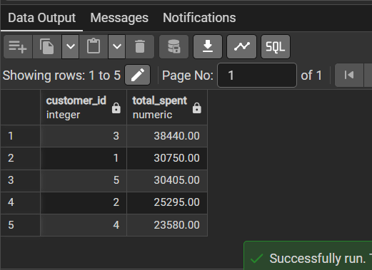
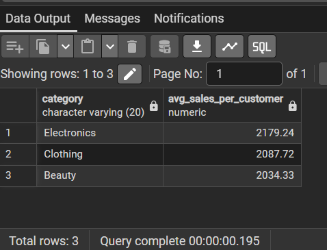
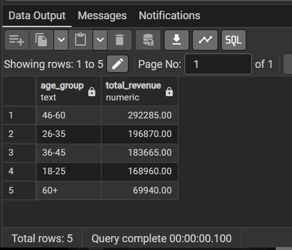
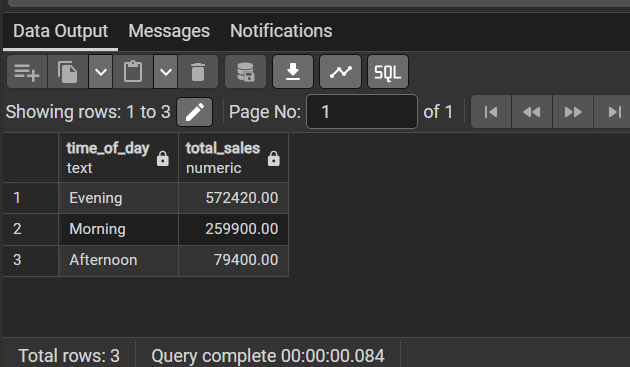

# Retail Sales Analysis using SQL

## Project Objective
The objective of this project is to analyze retail sales data using SQL to extract meaningful business insights.  
The analysis focuses on understanding customer purchasing behavior, identifying sales trends, and evaluating revenue patterns across product categories, customer demographics, and time periods.

This project demonstrates practical SQL skills used by data analysts to explore data, clean datasets, and answer real-world business questions.

---

## Dataset Information

The dataset contains retail transaction records including customer details, product category, and sales information.

### Dataset Columns

| Column Name | Description |
|-------------|-------------|
| transactions_id | Unique ID for each transaction |
| sale_date | Date of the sale |
| sale_time | Time when the transaction occurred |
| customer_id | Unique ID for each customer |
| gender | Customer gender |
| age | Customer age |
| category | Product category |
| quantity | Number of items purchased |
| price_per_unit | Price per unit of the product |
| cogs | Cost of goods sold |
| total_sale | Total value of the transaction |

---

## Project Structure

```
SQL-Retail-Sales-Project
│
├── screenshots
│ ├── age_group_revenue.png
│ ├── category_avg_sales_per_customer.png
│ ├── sales_by_time.png
│ └── top_5_customers.png
│
├── retail_analysis.sql
├── retail_sales_dataset.csv
└── README.md
```

---

## Data Analysis Process

The analysis was performed in multiple stages:

1. Database creation and table setup
2. Data exploration and preview
3. Data cleaning (handling NULL values and checking duplicates)
4. Business analysis using SQL queries
5. Extracting insights from the dataset

---

## Business Questions Answered

### Sales Performance
- What is the total revenue generated from sales?
- Which month recorded the highest sales?
- Which time of day generates the most revenue?

### Customer Behavior
- Who are the top 5 highest spending customers?
- Which gender spends more on average?
- Which customers purchase across multiple categories?

### Product Category Insights
- What is the average sale value for each category?
- Which category generates the highest revenue?
- Which category has the highest sales per customer?

### Time-Based Analysis
- Which hour of the day has the highest number of transactions?
- Which day of the week has the most sales?
- Which time period (Morning / Afternoon / Evening) generates the most revenue?

---

## Sample Analysis Results

### Top 5 Highest Spending Customers



---

### Category Average Sales Per Customer



---

### Highest Revenue Age Group



---

### Time of Day with the Most Sales



---

## Example SQL Query

### Which time of day has the most sales (Morning / Afternoon / Evening)?

```sql
SELECT 
    CASE 
        WHEN sale_time < '12:00:00' THEN 'Morning'
        WHEN sale_time BETWEEN '12:00:00' AND '17:00:00' THEN 'Afternoon'
        ELSE 'Evening'
    END AS time_of_day,
    SUM(total_sale) AS total_sales
FROM retail_sales
GROUP BY time_of_day
ORDER BY total_sales DESC;
```


### Identify the top 5 highest spending customers. 
```sql
SELECT customer_id,
       SUM(total_sale) AS total_spent
FROM retail_sales
GROUP BY customer_id
ORDER BY total_spent DESC
LIMIT 5;
```


### Find Customers Who Spend More Than Their Category Average
```sql
SELECT r.customer_id,
       r.category,
       r.total_sale
FROM retail_sales r
JOIN (
    SELECT category,
           AVG(total_sale) AS avg_category_sale
    FROM retail_sales
    GROUP BY category
) c
ON r.category = c.category
WHERE r.total_sale > c.avg_category_sale
ORDER BY category;
```

---

## Key Insights

• The **Electronics category generates the highest overall revenue** among all product categories.

• A small number of **high-value customers contribute a significant portion of total sales**, indicating potential for loyalty programs.

• **Evening hours generate the highest transaction volume**, suggesting peak shopping activity during that time.

• Customers aged **46–60 contribute the largest share of revenue**, making them an important target demographic.

• Some customers consistently make purchases that exceed the average sales value within their category, indicating potential premium customer segments.

---


## SQL Skills Demonstrated

• Data Exploration  
• Data Cleaning  
• Aggregate Functions (SUM, AVG, COUNT)  
• GROUP BY and HAVING  
• Subqueries  
• Window Functions  
• CASE Statements  
• Date and Time Analysis  
• Customer Behavior Analysis

---

## Tools Used

• PostgreSQL  
• SQL  
• Git  
• GitHub

---

## Dataset Source

This dataset is a sample retail transaction dataset used for SQL practice and data analysis projects.

---

## Author

**Jayshree Patidar**

Aspiring Data Analyst interested in SQL, data analysis, and business insights.

GitHub:
https://github.com/jayshreepatidar

---
